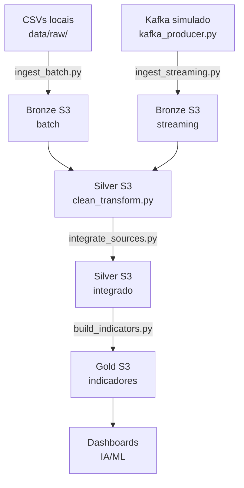

# Pipeline de Dados Educacionais — Alfabetização Brasil

## 1. Visão Geral

Este projeto implementa uma pipeline de dados escalável na AWS para monitorar o indicador de alfabetização infantil no Brasil, com base nos microdados do Saeb e nas metas do programa Compromisso Nacional Criança Alfabetizada.

**Indicador central:** percentual de alunos com proficiência ≥ 743 pontos em Língua Portuguesa no Saeb ao final do 2º ano do ensino fundamental.

**Fontes de dados:**
- Microdados de alunos (Saeb/INEP) — 3,8 milhões de registros
- Metas de alfabetização nacional, estadual e municipal (Base dos Dados)
- Dados territoriais de municípios e UFs (Base dos Dados)

---

## 2. Arquitetura



**Camada Bronze — Raw Data**
Ingestão dos dados brutos sem transformações de conteúdo. Suporta dois modos:
- Batch: CSVs convertidos para Parquet e particionados por `year=`
- Streaming: eventos simulados via Kafka, particionados por `year=/month=/`

**Camada Silver — Dados Tratados**
Limpeza, padronização e integração das bases:
- Renomeação de colunas do padrão INEP para padrão Base dos Dados
- Padronização da coluna `rede` para texto em todas as bases
- Remoção de registros inválidos e alunos ausentes
- Join entre microdados de alunos e dados agregados de municípios

**Camada Gold — Camada Analítica**
Indicadores prontos para consumo em dashboards e modelos de ML:
- `indicadores_municipio` — taxa real, gap de meta, flag de risco, projeção 2030
- `indicadores_uf` — comparação regional, desigualdade interna
- `evolucao_temporal` — comparação 2023 vs 2024 por município
- `indicadores_rede` — Estadual vs Municipal

---

## 3. Stack Tecnológica

| Camada | Tecnologia | Justificativa |
|---|---|---|
| Armazenamento | AWS S3 | Armazenamento escalável e de baixo custo para data lake |
| Processamento | Python + Pandas | Simplicidade e expressividade para pipelines de médio volume |
| Formato | Parquet | Compressão eficiente e suporte a pushdown de predicados |
| Streaming | Kafka simulado (Queue) | Demonstra padrão produtor/consumidor sem custo de infraestrutura |
| Credenciais | AWS Academy Learner Lab | Ambiente estudantil com créditos reais ($50) |
| Versionamento | Git + GitHub | Histórico organizado com Conventional Commits |

**Por que Pandas e não Spark?**
O volume dos dados (3,8M de registros) é processável em memória local. Spark traria complexidade de infraestrutura sem ganho real nesse escopo. A arquitetura foi desenhada para migração futura para Spark/EMR sem mudanças na lógica de negócio.

**Por que Kafka simulado e não AWS MSK?**
AWS MSK tem custo elevado e complexidade de configuração incompatível com o escopo acadêmico. A simulação via `queue.Queue` demonstra o padrão arquitetural produtor/consumidor com fidelidade suficiente para portfólio.

---

## 4. Estrutura do Repositório

AtividadePosTechFIAP_Fase02/
├── README.md

├── .gitignore

├── data/                          ← CSVs locais (não versionados)

│   └── raw/

├── src/
│   ├── bronze/
│   │   ├── ingest_batch.py        ← ingestão batch para o S3
│   │   ├── kafka_producer.py      ← produtor de eventos streaming
│   │   ├── ingest_streaming.py    ← consumidor — salva eventos no S3
│   │   └── main_streaming.py      ← orquestra produtor e consumidor
│   ├── silver/
│   │   ├── clean_transform.py     ← limpeza e padronização
│   │   └── integrate_sources.py   ← join alunos + município
│   └── gold/
│       └── build_indicators.py    ← cálculo dos indicadores analíticos
├── validation/
│   └── check_duplicates.py
└── infra/
├── .env.example
└── requirements.txt

---

**Estrutura no S3:**

alfabetizacao-datalake/
├── bronze/
│   ├── alunos/year=2023/dados.parquet
│   ├── alunos/year=2024/dados.parquet
│   ├── municipio/year={ano}/dados.parquet
│   ├── uf/year={ano}/dados.parquet
│   ├── meta_alfabetizacao_brasil/year={ano}/dados.parquet
│   ├── meta_alfabetizacao_uf/year={ano}/dados.parquet
│   ├── meta_alfabetizacao_municipio/year={ano}/dados.parquet
│   └── streaming/year=2026/month=06/evento_{timestamp}.parquet
├── silver/
│   ├── alunos/year={ano}/dados.parquet
│   ├── municipio/year={ano}/dados.parquet
│   ├── uf/year={ano}/dados.parquet
│   ├── meta_alfabetizacao_brasil/year={ano}/dados.parquet
│   ├── meta_alfabetizacao_uf/year={ano}/dados.parquet
│   ├── meta_alfabetizacao_municipio/year={ano}/dados.parquet
│   └── integrado/year={ano}/dados.parquet
└── gold/
├── indicadores_municipio/year={ano}/dados.parquet
├── indicadores_uf/year={ano}/dados.parquet
├── indicadores_rede/year={ano}/dados.parquet
└── evolucao_temporal/dados.parquet

---

## 5. Como Executar

### Pré-requisitos
```bash
pip install boto3 pandas pyarrow
```

### Configurar credenciais AWS
```bash
# Iniciar sessão no AWS Academy e copiar credenciais em:
~/.aws/credentials
```

### Executar os pipelines em ordem

```bash
# 1. Camada Bronze — batch
python src/bronze/ingest_batch.py

# 2. Camada Bronze — streaming simulado
python src/bronze/main_streaming.py

# 3. Camada Silver — limpeza e transformação
python src/silver/clean_transform.py

# 4. Camada Silver — integração
python src/silver/integrate_sources.py

# 5. Camada Gold — indicadores analíticos
python src/gold/build_indicators.py
```

---

## 6. Decisões Arquiteturais e Trade-offs

**Batch vs Streaming**
Os dados históricos (2023-2024) são processados em batch — carregamento único, sem necessidade de tempo real. O streaming foi implementado para simular a chegada de novos resultados de avaliação, demonstrando que a arquitetura suporta os dois padrões. Em produção, o Kafka seria substituído por AWS MSK ou Kinesis.

**Particionamento por `year=`**
Segue o padrão Hive, compatível com AWS Athena e Apache Spark. Permite pushdown de predicados — queries que filtram por ano leem apenas as partições necessárias, reduzindo custo e tempo.

**Metas na Gold, não na Silver**
As colunas de meta foram mantidas fora da tabela integrada da Silver para evitar repetir os mesmos valores de meta para cada um dos 3,3 milhões de registros de alunos. As metas entram apenas na Gold, após a agregação por município.

**Rede `'Pública'` calculada na Gold**
A base `meta_uf` define metas apenas para `rede = 'Pública'` (Estadual + Municipal combinados). Como os microdados não têm essa categoria, ela foi calculada como agregado na Gold para viabilizar a comparação com as metas oficiais.

**Pandas vs Spark**
Para o volume atual (3,8M registros), Pandas é suficiente e mais simples. A arquitetura medalhão e o particionamento Hive garantem que a migração para Spark/EMR seja possível sem reescrever a lógica de negócio.

---

## 7. Qualidade de Dados

### Base Alunos
| Decisão | Justificativa |
|---|---|
| Colunas renomeadas do padrão INEP para padrão Base dos Dados | Padronização para viabilizar joins |
| `TP_DEPENDENCIA` mapeado para texto | Dicionário oficial INEP |
| Rede Privada removida (25 registros) | Sem meta correspondente no projeto |
| Alunos ausentes removidos (512.153 registros) | Indicador mede alunos avaliados, não matriculados |

### Base UF e Município
| Decisão | Justificativa |
|---|---|
| `rede = 0` removido (1 registro em UF, 398 em Município) | Valor inválido — não consta no dicionário |
| `rede = 5` → `'Pública'` | Confirmado pelo dicionário oficial (Estadual + Municipal) |
| Nulos em `proporcao_aluno_nivel_X` mantidos | Dado só disponível a partir de 2024 — ausência esperada em 2023 |

### Simulação Streaming
| Decisão | Justificativa |
|---|---|
| UF Roraima (RR) excluída | Não consta nos microdados do Saeb disponíveis |
| `IN_PREENCHIMENTO_LP` excluído dos eventos | No streaming, todos os eventos representam alunos que fizeram a prova — valor seria sempre 1 |

---

## 8. FinOps

### Estratégias implementadas
- **Parquet com compressão Snappy** — reduz tamanho dos arquivos em ~75% vs CSV
- **Particionamento por `year=`** — evita full scan em queries filtradas por ano
- **Arquivos temporários deletados** — nenhum dado intermediário persiste localmente
- **AWS Academy Learner Lab** — ambiente com $50 de crédito, sem custo real

### Estimativa de custo mensal (produção)

| Serviço | Uso estimado | Custo estimado |
|---|---|---|
| S3 Standard | ~2 GB de dados | ~$0.05/mês |
| S3 PUT requests | ~500 requisições | ~$0.003/mês |
| Athena | 10 queries/mês, ~1GB scaneado | ~$0.05/mês |
| **Total estimado** | | **~$0.10/mês** |

Para escala maior (dados de todos os anos disponíveis + streaming real):
- S3 Intelligent-Tiering para dados históricos raramente acessados
- AWS Glue para orquestração dos pipelines em substituição à execução manual
- Spot Instances para processamento Spark em EMR

---

## 9. Aplicações em IA/ML

A camada Gold habilita diretamente os seguintes casos de uso:

**Modelos preditivos de alfabetização**
A tabela `evolucao_temporal` com `taxa_2023`, `taxa_2024` e `variacao` permite treinar modelos de regressão para prever a taxa de alfabetização futura por município, usando features como rede, UF e histórico de evolução.

**Clusterização de municípios por vulnerabilidade**
A tabela `indicadores_municipio` com `taxa_real_calculada`, `gap_meta_2024`, `flag_risco` e `crescimento_anual_necessario` permite clusterizar municípios por nível de vulnerabilidade educacional — identificando grupos que precisam de intervenção prioritária.

**Análise de desigualdade regional**
A coluna `desigualdade_interna` em `indicadores_uf` quantifica a disparidade entre o melhor e pior município de cada estado, permitindo identificar onde políticas de equalização seriam mais impactantes.

**Políticas públicas baseadas em evidências**
O indicador `crescimento_anual_necessario` permite simular cenários: dado o ritmo histórico de evolução, quais municípios precisariam de intervenção extraordinária para atingir a meta de 2030?

---

## 10. Observações e Limitações

- Os dados disponíveis cobrem apenas 2023 e 2024 — análises de tendência de longo prazo requerem anos anteriores
- UF Roraima (RR) não consta nos microdados do Saeb disponíveis e foi excluída da simulação de streaming
- O Kafka foi simulado via `queue.Queue` do Python — em produção seria substituído por AWS MSK ou Confluent Cloud
- As credenciais do AWS Academy Learner Lab são temporárias e expiram a cada sessão — o arquivo `~/.aws/credentials` precisa ser atualizado a cada novo acesso
- A camada Gold foi calculada apenas para redes Municipal e Estadual — a rede Federal tem representação insignificante no 2º ano do ensino fundamental
